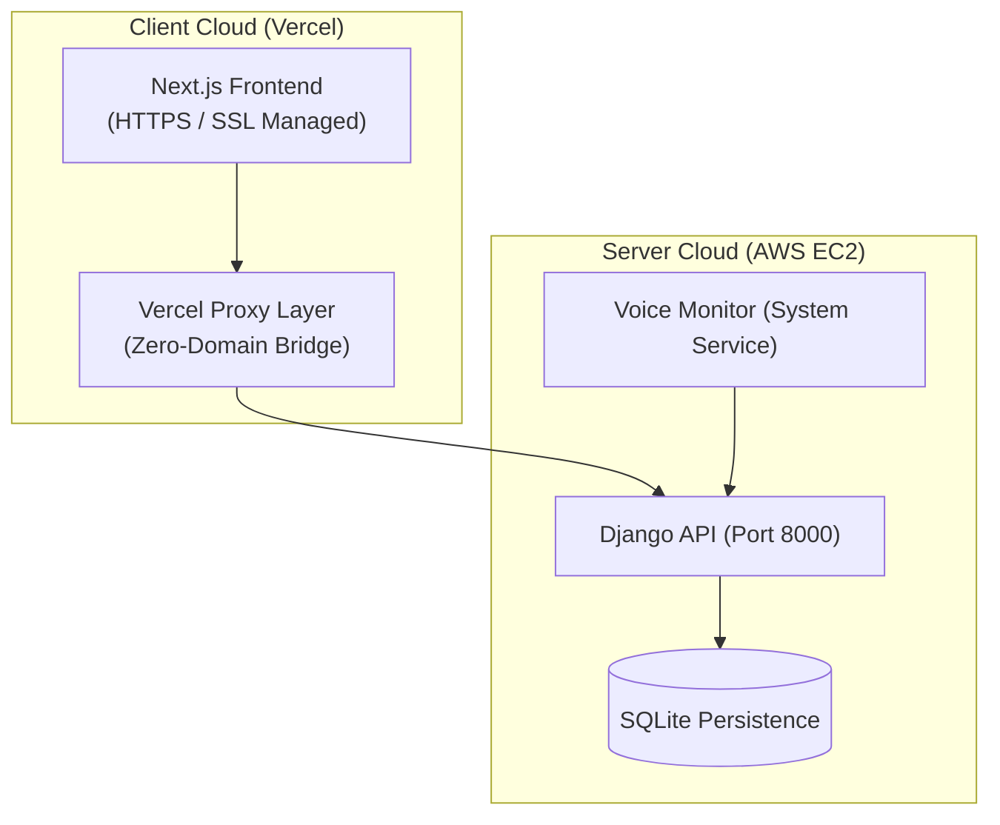

# MedAssist: AI-Powered Medication Adherence Ecosystem 🏥🤖🛡️

MedAssist is an integrated healthcare platform designed to enhance medication adherence through automation, predictive analytics, and cross-platform synchronization. 

---

## 🌟 Vision & Objectives
Elderly patients frequently struggle with complex medication schedules. MedAssist closes the oversight gap by providing:
- **Universal Voice Engine**: Zero-cost audible reminders via the Web Speech API and Android TTS.
- **Predictive Risk Modeling**: AI that identifies potential non-adherence before it happens.
- **Interactive AI Lab**: A visual playground for caretakers to understand AI decision-making.
- **Live Monitor**: Continuous background monitoring for real-time medication triggers.

## 🏗️ System Architecture (Production)



---

## 🚀 Production Quick Start (The "Zero-Domain" Way)

### **1. Backend (AWS EC2)**
- **OS**: Amazon Linux 2023 / Ubuntu.
- **Python**: 3.11+.
- **Setup**:
  ```bash
  git clone [Backend_URL] && cd backend
  python3.11 -m venv venv && source venv/bin/activate
  pip install -r requirements.txt
  python3 manage.py migrate && python3 manage.py seed_demo_data
  python3 manage.py runserver 0.0.0.0:8000
  ```

### **2. Frontend (Vercel)**
- **Root**: `frontend/`
- **Env Vars**: 
  - `NEXT_PUBLIC_API_URL`: `/api`
  - `AWS_BACKEND_URL`: `http://[YOUR_AWS_IP]:8000`

---

## 📁 Project Structure & Handoff

| Module | Description | Documentation |
| :--- | :--- | :--- |
| **Backend** | API, ML Models, OCR, Notifications | [Backend README](./backend/README.md) |
| **Frontend** | Patient/Caretaker Web Dashboards | [Frontend README](./frontend/README.md) |
| **Zero-Domain Deployment** | Vercel Proxy Architecture Guide | [PROD_DEPLOYMENT.md](./docs/PROD_DEPLOYMENT.md) |
| **Client Handoff** | Final Credentials & Login Guide | [CLIENT_HANDOFF.md](./docs/CLIENT_HANDOFF.md) |

---

## 🛡️ Technical Implementation Highlights
- **Universal Voice Engine**: Audible alerts for elderly patients via Web Speech API.
- **Vercel Proxy Bridge**: Secure connection to AWS backend without a domain name.
- **AI Adherence Logic**: Predictive risk analysis using RandomForest ML.
- **Clinical Admin**: Real-time patient profile configuration for caretakers.

---
*Maintained by the MedAssist Engineering Team. Optimized for Healthcare Excellence.* 🦅🛡️🔥🏆
