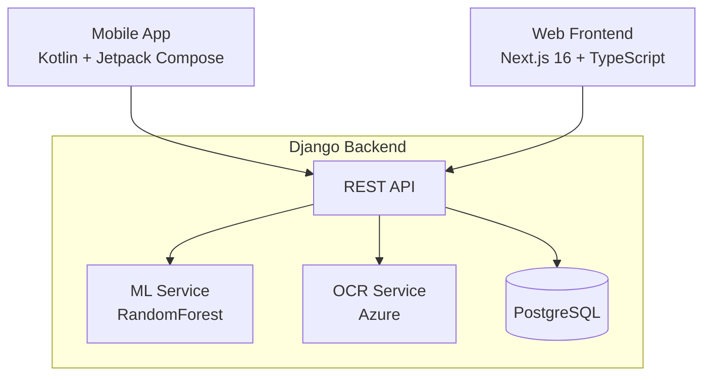

# MedAssist - AI-Powered Medication Adherence System

A comprehensive medication adherence tracking system for elderly patients, featuring a Django REST API backend, Next.js web frontend, and Kotlin Android mobile app.

## System Architecture



## Project Structure

```
medassist/
├── backend/              # Django REST API
├── frontend/            # Next.js Web App
├── mobile-app/          # Kotlin Android App
├── api-spec.md          # API Contract
└── CLAUDE.md           # Development Guide
```

## Tech Stack

| Component | Technology |
|-----------|------------|
| Backend | Django 5 + DRF + PostgreSQL |
| Frontend | Next.js 16 + TypeScript + Tailwind |
| Mobile | Kotlin + Jetpack Compose + Room |
| Auth | JWT (simplejwt) |
| ML | scikit-learn (RandomForest) |
| OCR | Azure Form Recognizer |

## Features

### For Caretakers
- Patient management (add, view, remove)
- Medication CRUD for patients
- View adherence statistics and streaks
- AI-powered risk predictions
- Prescription scanning with OCR
- High-risk patient alerts

### For Patients
- Today's medication schedule
- One-tap medication logging
- Adherence streak tracking
- Prescription scanning
- Adherence history with charts
- Medication reminders

## Getting Started

### Prerequisites
- Python 3.10+ (Backend)
- Node.js 18+ (Frontend)
- Android Studio + Kotlin (Mobile optional)
- PostgreSQL, SQLite for dev

### Backend Setup
```bash
cd backend
python -m venv venv
source venv/bin/activate
pip install -r requirements.txt
python manage.py migrate
python manage.py seed_demo_data
python manage.py runserver
```

### Frontend Setup
```bash
cd frontend
npm install
npm run dev
```

### Mobile Setup
1. Open mobile-app/ in Android Studio
2. Update BASE_URL in app/build.gradle.kts
3. Build and run on device/emulator

## API Endpoints

### Authentication
- POST /api/auth/register/ - Register new user
- POST /api/auth/login/ - Login (get tokens)
- POST /api/auth/refresh/ - Refresh access token
- GET /api/auth/me/ - Get current user

### Patients (Caretaker only)
- GET /api/patients/ - List patients
- POST /api/patients/ - Create patient
- GET /api/patients/{id}/ - Get patient
- GET /api/patients/{id}/detail_with_data/ - Full patient data

### Medications
- GET /api/medications/ - List medications
- POST /api/medications/ - Create medication
- DELETE /api/medications/{id}/ - Soft-delete

### Adherence
- POST /api/adherence/log/ - Log medication intake
- GET /api/adherence/history/ - Get history
- GET /api/adherence/stats/ - Get statistics
- GET /api/schedule/today/ - Today's schedule

### Predictions
- GET /api/predictions/{patient_id}/ - Get AI predictions

### Prescriptions
- POST /api/prescriptions/scan/ - OCR scan

## Demo Credentials

After running seed_demo_data:

| Role | Email | Password |
|------|-------|----------|
| Caretaker | dr.smith@medassist.com | MedAssist2026! |
| Patient | john.doe@example.com | MedAssist2026! |

## Data Models

### User
- id (int, PK)
- email (string, unique)
- name (string)
- phone (string)
- role (caretaker/patient)
- is_active (bool)
- created_at (datetime)

### PatientProfile
- id (int, PK)
- user_id (int, FK to User)
- caretaker_id (int, FK to User)
- age (int)
- medical_conditions (string)
- created_at (datetime)

### Medication
- id (int, PK)
- name (string)
- dosage (string)
- frequency (string)
- timings (JSON)
- instructions (string)
- patient_id (int, FK to User)
- created_by_id (int, FK to User)
- is_active (bool)
- created_at (datetime)

### AdherenceLog
- id (int, PK)
- medication_id (int, FK to Medication)
- patient_id (int, FK to User)
- scheduled_time (datetime)
- taken_time (datetime, nullable)
- status (taken/missed/late)
- created_at (datetime)

## Documentation

Each component has its own detailed README:

- [Backend README](backend/README.md)
- [Frontend README](frontend/README.md)
- [Mobile App README](mobile-app/README.md)

## Repository Links

- **Backend**: https://github.com/santoshi004/Backend
- **Frontend**: https://github.com/ramyaS1205/Front-end
- **Mobile**: https://github.com/Savita-debug/mobile-app
