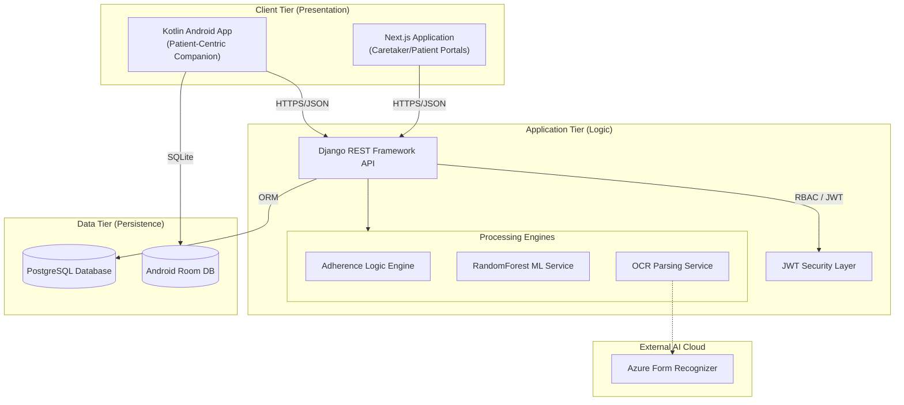
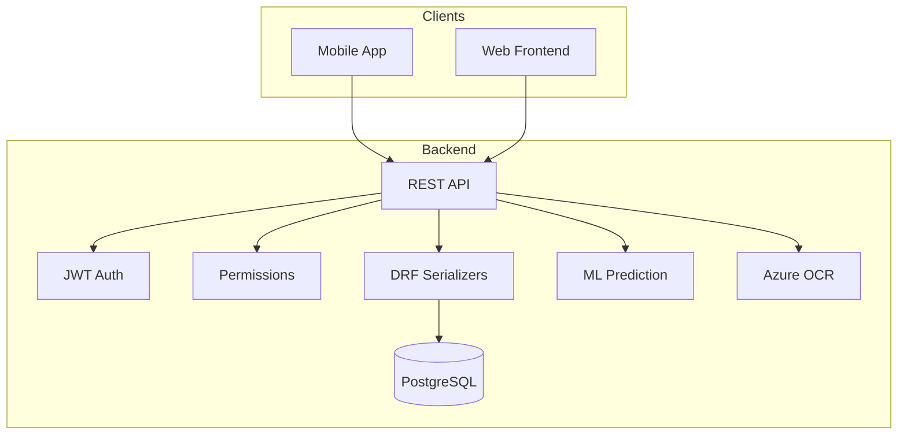
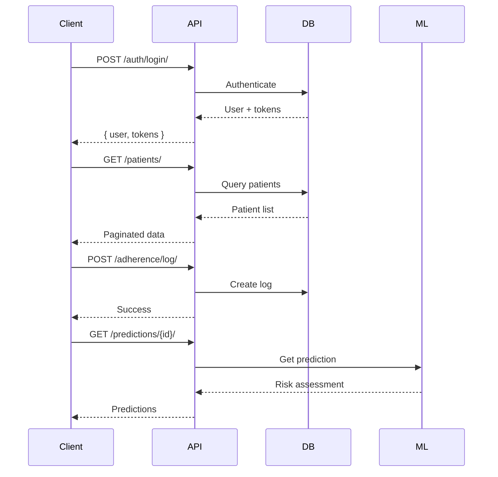

<<<<<<< HEAD
# MedAssist: Technical System Overview

MedAssist is an integrated healthcare ecosystem designed to enhance medication adherence through automation, predictive analytics, and cross-platform synchronization. This documentation serves as the master technical guide for the entire system.

## 1. System Philosophy and Objectives

The core objective of MedAssist is to close the feedback loop between patient behavior and caretaker oversight. The system addresses the "silent" nature of medication non-adherence by:
- **Digitizing Input**: Converting physical prescriptions into digital schedules using OCR.
- **Active Monitoring**: Recording real-time adherence logs (Taken, Late, Missed).
- **Predictive Intervention**: Using Machine Learning to identify high-risk patients before health complications occur.

## 2. Global Architecture

The system follows a distributed client-server architecture with a centralized AI-powered backend.



## 3. The MedAssist Life Cycle (Data Flow)

To understand the system, one must trace the life cycle of a single medication dose from creation to analysis:

1.  **Ingestion (OCR Layer)**:
    - A caretaker uploads a prescription image via the Web or Mobile interface.
    - The Backend proxies the image to **Azure Form Recognizer**.
    - The raw OCR JSON is mapped to internal `Medication` objects (Name, Dosage, Frequency, Timings).
2.  **Scheduling (Persistence Layer)**:
    - `Medication` objects are committed to PostgreSQL.
    - An automated process generates daily `ScheduleEntry` items for each patient based on the frequency (Once Daily, Twice Daily, etc.).
3.  **Engagement (Interaction Layer)**:
    - The Mobile App pulls the `TodaySchedule`.
    - If offline, the app uses the local **Room DB**.
    - The patient logs an intake. This triggers an immediate timestamp record (`taken_time`).
4.  **Analysis (Intelligence Layer)**:
    - Every log entry is fed into a **Random Forest** feature extractor.
    - The system calculates metrics: `avg_delay`, `miss_rate`, and `consecutive_misses`.
    - The caretaker sees the resulting `Risk Level` (Low/Medium/High) on their dashboard.

## 4. Technology Stack Summary

| Layer | Responsibility | Technology |
| :--- | :--- | :--- |
| **Backend** | API, ML, OCR, DB Management | Python 3.11, Django 5.0, DRF, Scikit-Learn |
| **Web** | Caretaker Dashboard, Detailed Analytics | Next.js 15, TypeScript, Tailwind CSS |
| **Mobile** | Reminders, Offline Logging, UI | Kotlin, Jetpack Compose, Room, AlarmManager |
| **Infrastructure** | Identity, External AI | SimpleJWT, Azure AI Services |

## 📁 Technical Implementation Guides

For a granular understanding of the system's data flow and logic implementation, refer to these professional guides:

- [**Data Dictionary**](./docs/technical-guides/data-dictionary.md): Field-level mapping of every data point.
- [**Prescription Flow Trace**](./docs/technical-guides/prescription-flow-trace.md): Code execution path for OCR and scanning.
- [**Adherence Algorithms**](./docs/technical-guides/adherence-algorithms.md): Mathematical logic for streaks and scores.
- [**ML Model Details**](./docs/technical-guides/ml-model-details.md): Feature engineering and predictive logic.
- [**Mobile Architecture & Sync**](./docs/technical-guides/mobile-architecture-sync.md): Offline persistence and alarm management.

## 5. Repository Structure (Monorepo)

For development ease, this project is structured as a monorepo. Detailed technical documentation for each component is available in their respective directories:

- [**backend/**](./backend): API endpoints, Machine Learning pipelines, and Database schema.
- [**frontend/**](./frontend): Web-based dashboards and state management patterns.
- [**mobile-app/**](./mobile-app): Android-specific implementation including local persistence and system-level alarms.

---
*Technical documentation maintained by the MedAssist Engineering Team.*
=======
# MedAssist Backend

AI-Powered Medication Adherence System - Django REST API backend.

## Architecture



## Data Models

### User
- id (int, PK)
- email (string, unique)
- name (string)
- phone (string)
- role (caretaker/patient)
- is_active (bool)
- created_at (datetime)

### PatientProfile
- id (int, PK)
- user_id (int, FK to User)
- caretaker_id (int, FK to User)
- age (int)
- medical_conditions (string)
- created_at (datetime)

### Medication
- id (int, PK)
- name (string)
- dosage (string)
- frequency (string)
- timings (JSON)
- instructions (string)
- patient_id (int, FK to User)
- created_by_id (int, FK to User)
- is_active (bool)
- created_at (datetime)

### AdherenceLog
- id (int, PK)
- medication_id (int, FK to Medication)
- patient_id (int, FK to User)
- scheduled_time (datetime)
- taken_time (datetime, nullable)
- status (taken/missed/late)
- created_at (datetime)

### Prediction
- id (int, PK)
- patient_id (int, FK to User)
- medication_id (int, FK to Medication, nullable)
- predicted_delay_minutes (int)
- risk_level (low/medium/high)
- message (string)
- generated_at (datetime)

### Prescription
- id (int, PK)
- image (image)
- extracted_data (JSON)
- uploaded_by_id (int, FK to User)
- patient_id (int, FK to User)
- created_at (datetime)

## API Flow



## Tech Stack

| Category | Technology |
|----------|------------|
| Framework | Django 5 + DRF |
| Database | PostgreSQL |
| Auth | JWT |
| ML | scikit-learn |
| OCR | Azure Form Recognizer |

## Setup

```bash
cd backend
python -m venv venv
source venv/bin/activate
pip install -r requirements.txt
python manage.py migrate
python manage.py seed_demo_data
python manage.py runserver
```

## Demo Credentials

| Role | Email | Password |
|------|-------|----------|
| Caretaker | dr.smith@medassist.com | MedAssist2026! |
| Patient | john.doe@example.com | MedAssist2026! |

## API Endpoints

### Auth
- POST /api/auth/register/
- POST /api/auth/login/
- POST /api/auth/refresh/
- GET /api/auth/me/

### Patients
- GET /api/patients/
- POST /api/patients/
- GET /api/patients/{id}/
- GET /api/patients/{id}/detail_with_data/

### Medications
- GET /api/medications/
- POST /api/medications/
- DELETE /api/medications/{id}/

### Adherence
- POST /api/adherence/log/
- GET /api/adherence/history/
- GET /api/adherence/stats/
- GET /api/schedule/today/

### Predictions
- GET /api/predictions/{patient_id}/

### Prescriptions
- POST /api/prescriptions/scan/

## Project Structure

```
backend/
├── manage.py
├── medassist_backend/
├── accounts/
├── medications/
├── adherence/
├── prescriptions/
├── predictions/
├── ml_models/
├── media/
└── requirements.txt
```
>>>>>>> backend-origin/main
