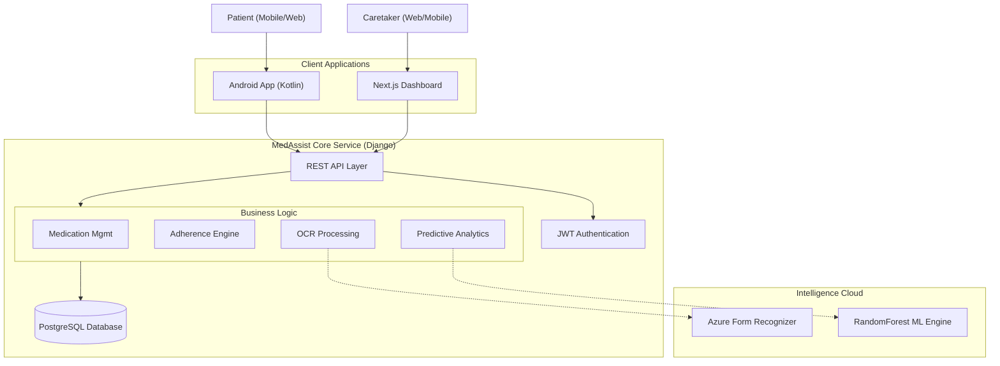
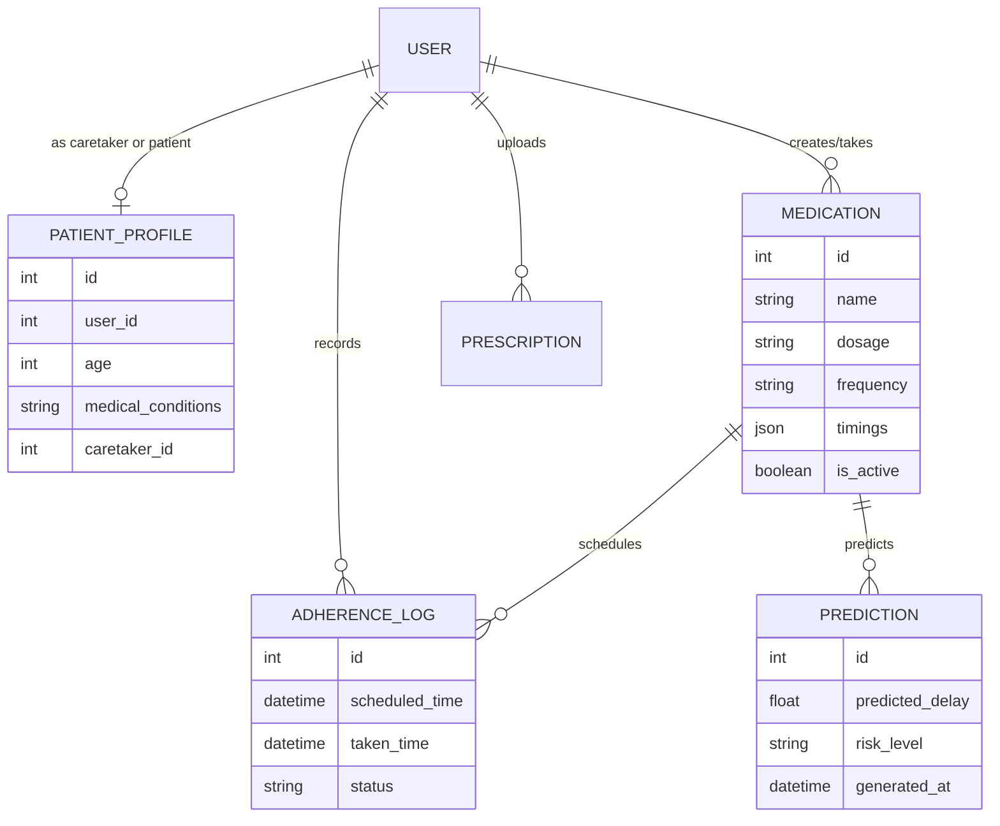

# 💊 MedAssist: AI-Powered Medication Adherence System

[](https://opensource.org/licenses/MIT)
[](https://www.python.org/)
[](https://www.djangoproject.com/)
[](https://nextjs.org/)
[](https://kotlinlang.org/)

MedAssist is a state-of-the-art health ecosystem designed to solve one of the most persistent challenges in healthcare: **medication non-adherence**. Combining Cloud AI, Machine Learning, and an intuitive Cross-Platform UI, MedAssist ensures patients stay on track while giving caretakers peace of mind.

---

## 🏗 System Architecture

The MedAssist ecosystem is built on a scalable, modular architecture designed for high availability and intelligent data processing.



---

## 📂 Project Structure (Monorepo)

This repository is organized as a **Monorepo**, housing the entire ecosystem in three main modules:

| Module | Purpose | Tech Stack |
| :--- | :--- | :--- |
| [**`backend/`**](./backend) | The heart of the system—handles API, ML, and OCR. | Django, DRF, scikit-learn |
| [**`frontend/`**](./frontend) | The web-based dashboard for caretakers and patients. | Next.js 15, TypeScript, Tailwind |
| [**`mobile-app/`**](./mobile-app) | The patient-centric Android application. | Kotlin, Jetpack Compose, Room |

---

## ✨ Key Features

### 🔎 Intelligent OCR Scanning
Upload a photograph of any prescription. MedAssist uses **Azure Form Recognizer** to intelligently parse medication names, dosages, and frequencies, allowing for 1-click schedule creation.

### 🔮 Predictive Analytics
Built on a **Random Forest** model, MedAssist analyzes historical adherence patterns to predict:
- **Risk Level**: High, Medium, or Low risk of future non-adherence.
- **Predicted Delay**: Calculated in minutes for upcoming doses.
- **Behavior Patterns**: Identifies specific times or days when a patient is most likely to miss.

### 📋 Full-Cycle Tracking
- **Caretakers**: Manage patient lists, set complex intervals, and see real-time alerts.
- **Patients**: Simplified "1-tap" logging, daily schedules, and progress streaks.

---

## 📊 Database Schema (ERD)



---

## 🚀 Quick Start

### 1. Prerequisites
- Docker (optional) OR Python 3.11, Node.js 20, and Android Studio.
- Azure Form Recognizer Key (for OCR).

### 2. Launch Backend
```bash
cd backend
python -m venv venv && source venv/bin/activate
pip install -r requirements.txt
python manage.py migrate
python manage.py seed_demo_data
python manage.py runserver
```

### 3. Launch Frontend
```bash
cd frontend
npm install
npm run dev
```

---

## 👨‍🎓 Final Year Project Details
*This project was developed as a comprehensive healthcare solution for Final Year Engineering curriculum.*

**Team Leads**: 
- **Backend Architecture**: [Santoshi](https://github.com/santoshi004)
- **Frontend/UI Experience**: [Ramya](https://github.com/ramyaS1205)
- **Mobile Systems**: [Savita](https://github.com/Savita-debug)

---
<p align="center">Made with ❤️ for Health Tech Excellence</p>
