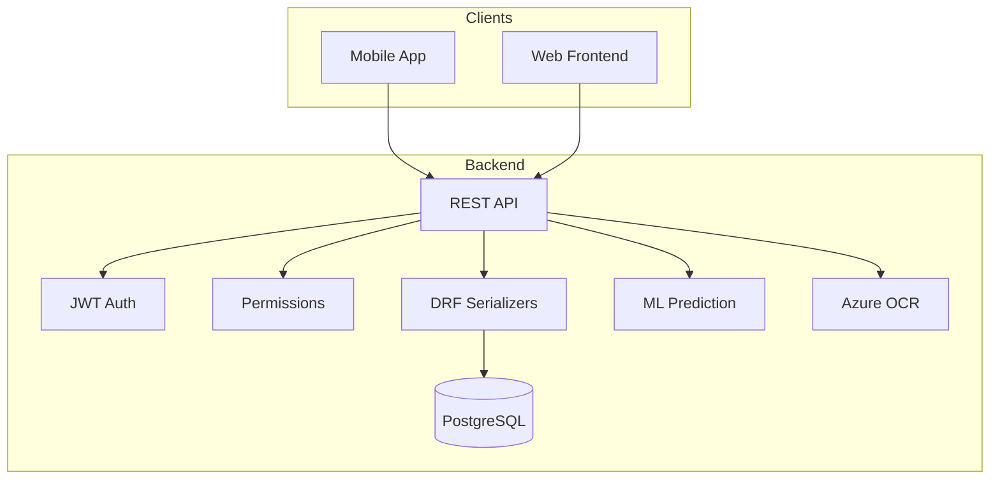

# MedAssist Backend

AI-Powered Medication Adherence System - Django REST API backend.

## Architecture



## Data Models

### User
- id (int, PK)
- email (string, unique)
- name (string)
- phone (string)
- role (caretaker/patient)
- is_active (bool)
- created_at (datetime)

### PatientProfile
- id (int, PK)
- user_id (int, FK to User)
- caretaker_id (int, FK to User)
- age (int)
- medical_conditions (string)
- created_at (datetime)

### Medication
- id (int, PK)
- name (string)
- dosage (string)
- frequency (string)
- timings (JSON)
- instructions (string)
- patient_id (int, FK to User)
- created_by_id (int, FK to User)
- is_active (bool)
- created_at (datetime)

### AdherenceLog
- id (int, PK)
- medication_id (int, FK to Medication)
- patient_id (int, FK to User)
- scheduled_time (datetime)
- taken_time (datetime, nullable)
- status (taken/missed/late)
- created_at (datetime)

### Prediction
- id (int, PK)
- patient_id (int, FK to User)
- medication_id (int, FK to Medication, nullable)
- predicted_delay_minutes (int)
- risk_level (low/medium/high)
- message (string)
- generated_at (datetime)

### Prescription
- id (int, PK)
- image (image)
- extracted_data (JSON)
- uploaded_by_id (int, FK to User)
- patient_id (int, FK to User)
- created_at (datetime)

## API Flow

```mermaid
sequenceDiagram
    participant Client
    participant API
    participant DB
    participant ML
    
    Client->>API: POST /auth/login/
    API->>DB: Authenticate
    DB-->>API: User + tokens
    API-->>Client: { user, tokens }
    
    Client->>API: GET /patients/
    API->>DB: Query patients
    DB-->>API: Patient list
    API-->>Client: Paginated data
    
    Client->>API: POST /adherence/log/
    API->>DB: Create log
    API-->>Client: Success
    
    Client->>API: GET /predictions/{id}/
    API->>ML: Get prediction
    ML-->>API: Risk assessment
    API-->>Client: Predictions
```



## Tech Stack

| Category | Technology |
|----------|------------|
| Framework | Django 5 + DRF |
| Database | PostgreSQL |
| Auth | JWT |
| ML | scikit-learn |
| OCR | Azure Form Recognizer |

## Setup

```bash
cd backend
python -m venv venv
source venv/bin/activate
pip install -r requirements.txt
python manage.py migrate
python manage.py seed_demo_data
python manage.py runserver
```

## Demo Credentials

| Role | Email | Password |
|------|-------|----------|
| Caretaker | dr.smith@medassist.com | MedAssist2026! |
| Patient | john.doe@example.com | MedAssist2026! |

## API Endpoints

### Auth
- POST /api/auth/register/
- POST /api/auth/login/
- POST /api/auth/refresh/
- GET /api/auth/me/

### Patients
- GET /api/patients/
- POST /api/patients/
- GET /api/patients/{id}/
- GET /api/patients/{id}/detail_with_data/

### Medications
- GET /api/medications/
- POST /api/medications/
- DELETE /api/medications/{id}/

### Adherence
- POST /api/adherence/log/
- GET /api/adherence/history/
- GET /api/adherence/stats/
- GET /api/schedule/today/

### Predictions
- GET /api/predictions/{patient_id}/

### Prescriptions
- POST /api/prescriptions/scan/

## Project Structure

```
backend/
├── manage.py
├── medassist_backend/
├── accounts/
├── medications/
├── adherence/
├── prescriptions/
├── predictions/
├── ml_models/
├── media/
└── requirements.txt
```
