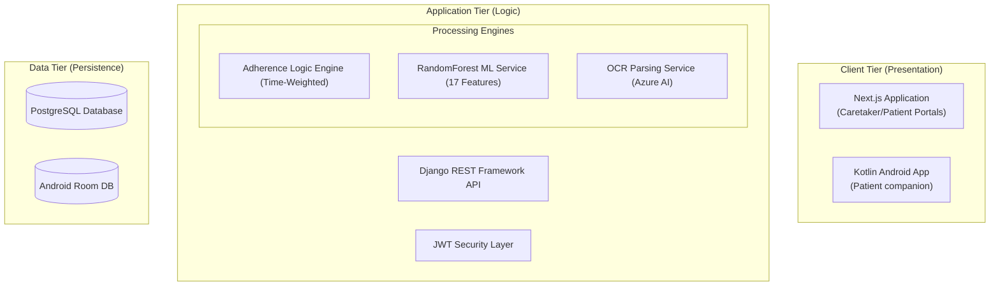

# MedAssist: AI-Powered Medication Adherence Ecosystem 🏥🤖🛡️

MedAssist is an integrated healthcare platform designed to enhance medication adherence through automation, predictive analytics, and cross-platform synchronization. 

---

## 🌟 Vision & Objectives
Elderly patients frequently struggle with complex medication schedules. MedAssist closes the oversight gap by providing:
- **Zero-Cost Voice Alerts**: Local TTS reminders on both Web and Android.
- **Predictive Risk Modeling**: AI that identifies potential non-adherence before it happens.
- **Interactive AI Lab**: A visual playground for caretakers to understand AI decision-making.
- **Universal Synchronization**: Real-time status updates across Web and Mobile.

## 🏗️ System Architecture



---

## 🚀 Quick Start Guide

### **1. Backend (API & ML)**
```bash
cd backend
python3 -m venv venv && source venv/bin/activate
pip install -r requirements.txt
python3 manage.py migrate
python3 manage.py runserver  # PORT 8000
```

### **2. Frontend (Patient/Caretaker Dashboard)**
```bash
cd frontend
npm install
npm run dev  # PORT 3000
```

### **3. Automatic Voice Monitor (CRITICAL)**
To enable the automatic voice reminders for your demo, run this in a separate terminal:
```bash
python3 manage.py check_reminders --loop
```

---

## 📁 Project Structure & Documentation

| Module | Description | Documentation |
| :--- | :--- | :--- |
| **Backend** | API, ML Models, OCR, Notifications | [Backend README](./backend/README.md) |
| **Frontend** | Patient/Caretaker Web Dashboards | [Frontend README](./frontend/README.md) |
| **Mobile App** | Kotlin companion with offline sync | [Mobile README](./mobile-app/README.md) |
| **AI Lab** | Visual analytics and predictivity | [AI Lab Walkthrough](./docs/AI_LAB_WALKTHROUGH.md) |
| **Deployment** | Production & Server configuration | [DEPLOYMENT.md](./DEPLOYMENT.md) |

---

## 🛡️ Technical Implementation Highlights
- **Weighted Adherence**: Uses a time-decay algorithm (`max(0.4, 1.0 - (hours_late * 0.1))`) for granular health monitoring.
- **VAPID WebPush**: Native background notifications without 3rd party cloud fees.
- **Azure AI Ingestion**: OCR-based prescription scanning for zero-manual-entry setup.
- **Robust Mobile Build**: Official APK included at `releases/medassist-v1.0-debug.apk`.

---
*Maintained by the MedAssist Engineering Team. Optimized for Healthcare Excellence.* 🦅🛡️🔥🏆
