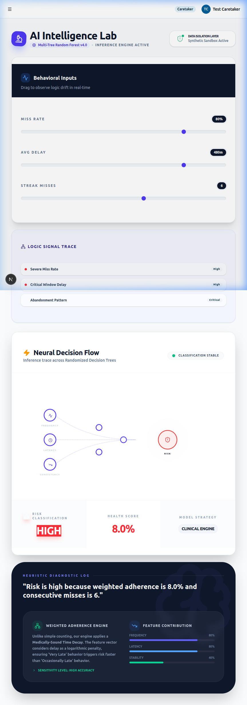

# Artificial Intelligence Laboratory Walkthrough

This document provides a detailed showcase of the **AI Intelligence Lab** implemented in MedAssist.

## 🧪 The "AI Intelligence Lab" (Advanced Demo Tool)

The Lab is a bespoke educational module designed for clinical demonstrations and "What-If" scenario planning.

### 1. Neural Decision Flow (Visualization)
- **Signal Tracking**: An animated SVG visualizer treats behavioral metrics (Frequency, Latency, Stability) as electrical signals.
- **Decision Path**: Visualizes the "Inference Trace" through Randomized Decision Trees and Voter Nodes.
- **Real-time Feedback**: Input nodes have intensity rings that glow based on the severity of the behavioral data.

### 2. Hybrid Intelligence Engine
- **The Brain**: Uses a 17-feature Random Forest model.
- **17th Feature**: We've integrated the **Weighted Adherence** (Time-Decay) score as a primary feature.
- **Safety Logic**: Combines ML predictions with a deterministic **Clinical Ruleset**. If the AI is conservative, the clinical engine flags risks immediately based on medical thresholds (e.g., < 45% weighted adherence).

### 3. Demonstration Showcase
Below is a captures from the active "High Risk" trajectory simulation.

*Figure 1: AI Laboratory identifying a High Risk patient pattern based on severe miss rate and 8-hour latency.*

---

## 🛠️ Weighted Adherence Logic (The Math)

Adherence is no longer binary. We implemented a linear decay function: 
- **Penalty**: `hours_late * 0.1` 
- **Score**: `max(0.4, 1.0 - Penalty)`

This rewards "partial compliance" (taking a pill late) while strictly penalizing prolonged delays, providing a more nuanced health metric than simple "Taken/Missed."

---

## 🛡️ Sandbox Isolation
The Lab operates in a **Synthetic Sandbox** (`Sandbox Mode`). It never saves to the database or affects real patient adherence history, making it 100% safe for educational trainers to use with live patients nearby.
