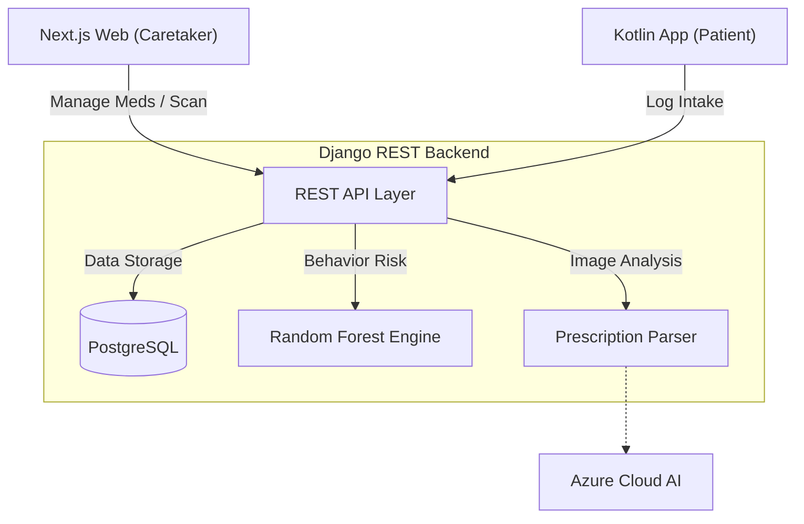

# 💻 MedAssist Frontend: Healthcare Dashboard

[](https://nextjs.org/)
[](https://www.typescriptlang.org/)
[](https://tailwindcss.com/)

The frontend is the primary interface for **Caretakers (Doctors/Family)** and **Patients**. It transforms complex medical data and AI predictions into an intuitive, accessible experience.

---

## 🌎 System Overview (The Big Picture)

MedAssist is a multi-component ecosystem. The Frontend depends on the Backend for data and AI processing.

### Full System Architecture


### The "MedAssist Cycle"
1. **Management**: A caretaker signs in and scans a physical prescription.
2. **Analysis**: The frontend displays the OCR results for verification.
3. **Monitoring**: The caretaker views the **Patient Detail Page**, which pulls AI-calculated risk levels from the backend.
4. **Adherence**: The patient uses the dashboard or the mobile app to log their daily intake, which is then charted in real-time.

---

## 🎨 Design Philosophy
- **Accessibility First**: Large font sizes, high-contrast badges, and simple navigation paths for elderly patients.
- **Predictive Visualization**: High-risk patients are flagged with "Red" alerts immediately on the dashboard using backend AI data.
- **Micro-Interactions**: Real-time feedback and toast notifications for all medication logging actions.

---

## 🏗 Frontend Structure
- **`src/app/(dashboard)/caretaker`**: Complex monitoring tools and patient management.
- **`src/app/(dashboard)/patient`**: Simplified schedule view and personal history.
- **`src/components/shared`**: Reusable healthcare components (Prescription Scanner, Medication Cards).

---

## 🚀 Setup & Installation

1. Install dependencies:
   ```bash
   npm install
   ```
2. Configure Environment:
   Create a `.env.local` file:
   ```
   NEXT_PUBLIC_API_URL=http://localhost:8000/api
   ```
3. Start the UI:
   ```bash
   npm run dev
   ```

---
<p align="center">Part of the MedAssist Final Year Project Ecosystem</p>
