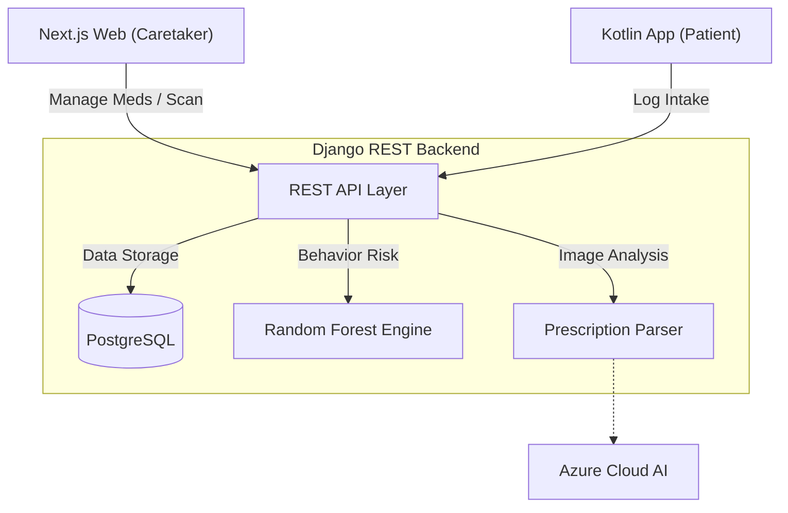

# 📱 MedAssist Mobile: Patient Care Companion

The mobile app is the "Boots on the Ground" for MedAssist. It lives in the patient's pocket, providing offline medication management, intelligent reminders, and seamless data sync.

---

## 🌎 System Overview (The Big Picture)

MedAssist is an ecosystem. The Mobile app acts as a local node that syncs with the central Backend.

### Full System Architecture

### The "MedAssist Cycle"
1. **Sync**: On startup, the app pulls the full medication list and `TodaySchedule` from the backend.
2. **Persistence**: All data is stored in the **Room Database** for offline access.
3. **Alarms**: `AlarmManager` schedules precise system notifications for every med.
4. **Loopback**: When the patient taps "Take" on a notification, it updates the local DB and sends a POST request to the backend to update caretaker statistics.

---

## 🌟 Mobile Features

### Offline-First Architecture
Designed for reliability. Even if the patient has no internet, the medication alarms will trigger, and all logs will be queued for sync once the network returns.

### Exact Medication Alarms
Uses the Android System Alarm service to ensure notifications are never delayed by battery-saving "Doze" modes.

---

## 🏗 Technical Stack
- **UI**: Jetpack Compose (Declarative UI).
- **Storage**: Room (Local SQL cache).
- **Networking**: Retrofit + OkHttp.
- **Scheduling**: WorkManager (Background Sync) + AlarmManager (Notifications).

---

## 🚀 Getting Started

1. Open this folder in **Android Studio**.
2. Sync the project with Gradle.
3. Replace the `BASE_URL` in your network constants with your Backend's IP address.
4. Build and run on an Android device (API Level 26+).

---

Part of the MedAssist Final Year Project Ecosystem

